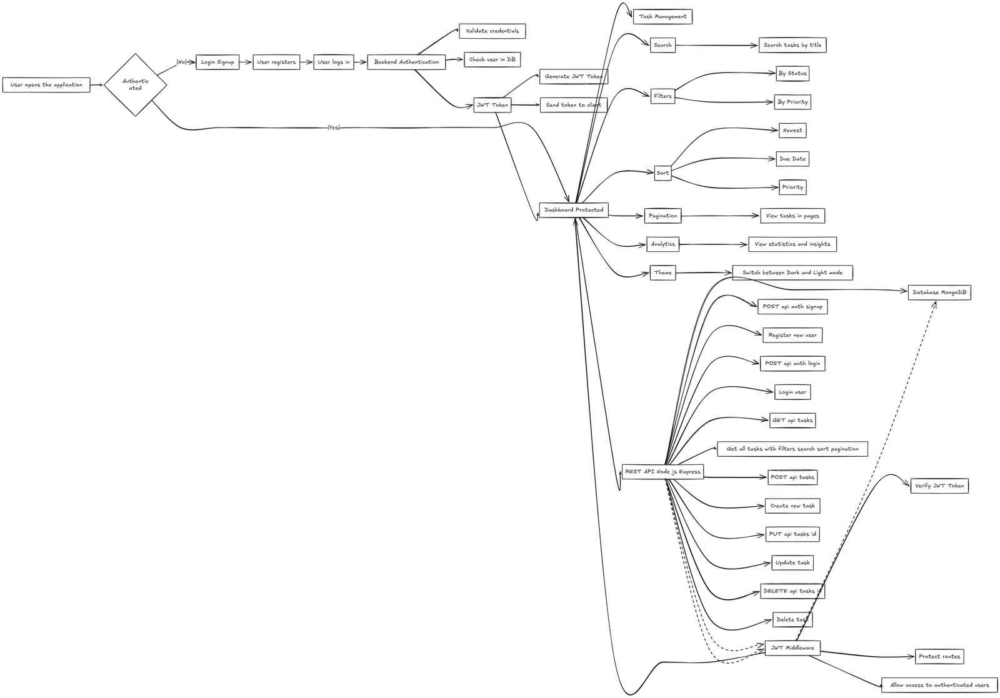

## 🚀 TaskFlow - Full Stack Task Tracker

A full-stack Task Management application built with React, Node.js, Express, and MongoDB. Users can securely manage their tasks with authentication, search, filters, sorting, pagination, analytics, and dark mode.

## ✨ Features

- 🔐 User Signup and Login
- 🛡️ JWT Authentication
- 🔒 Protected Dashboard Routes
- ➕ Create Tasks
- ✏️ Edit Tasks
- 🗑️ Delete Tasks
- ✅ Mark Tasks as Completed
- 🔍 Search Tasks by Title
- 🎯 Filter by Status
- ⚡ Filter by Priority
- ↕️ Sort by Newest, Due Date, and Priority
- 📄 Pagination
- 📊 Task Analytics
- 🌙 Dark Mode / Light Mode
- 📱 Responsive Design

---

## 🛠️ Tech Stack

### Frontend

- React.js
- Vite
- Tailwind CSS
- React Router DOM
- Axios
- Lucide React

### Backend

- Node.js
- Express.js
- MongoDB
- Mongoose
- JWT
- bcryptjs

---

# 📁 Project Structure

```text
task-tracker/
│
├── client/
│   ├── src/
│   │   ├── components/
│   │   ├── hooks/
│   │   ├── pages/
│   │   ├── services/
│   │   ├── App.jsx
│   │   └── main.jsx
│
└── server/
    ├── config/
    ├── controllers/
    ├── middleware/
    ├── models/
    ├── routes/
    └── server.js
```

---
# 📁 Project Architecture

```text
                    TaskFlow
                       │
          ┌────────────┴────────────┐
          │                         │
       Frontend                  Backend
          │                         │
   React + Tailwind          Node + Express
          │                         │
    ┌─────┼─────┐            ┌──────┼──────┐
    │     │     │            │      │      │
  Pages Components Hooks  Routes Controllers Models
    │                       │
    │                    Middleware
    │                       │
    └────────── API ────────┘
                            │
                         MongoDB
```

# ⚙️ Setup Steps

## 1. Clone the Repository

```bash
git clone <https://github.com/rajeevroy21/Task-tracker.git>
```

## 2. Install Frontend Dependencies

```bash
cd client
npm install
```

## 3. Run the Frontend

```bash
npm run dev
```

Frontend runs on:

```text
http://localhost:5173
```

---

## 4. Install Backend Dependencies

Open another terminal:

```bash
cd server
npm install
```

## 5. Create Environment Variables

Create a `.env` file inside the `server` folder:

```env
PORT=5000
MONGO_URI=your_mongodb_connection_string
JWT_SECRET=your_jwt_secret
```

## 6. Run the Backend

```bash
npm run dev
```

Backend runs on:

```text
http://localhost:5000
```

---

# 🔌 API Endpoints

## Authentication

### Signup

```text
POST /api/auth/signup
```

Example request:

```json
{
  "name": "Rajeev Kumar",
  "email": "example@gmail.com",
  "password": "123456"
}
```

### Login

```text
POST /api/auth/login
```

Example request:

```json
{
  "email": "example@gmail.com",
  "password": "123456"
}
```

---

# 📋 Task Endpoints

### Create Task

```text
POST /api/tasks
```

### Get All Tasks

```text
GET /api/tasks
```

### Get Single Task

```text
GET /api/tasks/:id
```

### Update Task

```text
PUT /api/tasks/:id
```

### Delete Task

```text
DELETE /api/tasks/:id
```

---

# 🔍 Search, Filter & Sorting

### Search Tasks

```text
GET /api/tasks?search=taskname
```

### Filter by Status

```text
GET /api/tasks?status=todo
```

Available statuses:

```text
todo
in-progress
done
```

### Filter by Priority

```text
GET /api/tasks?priority=high
```

Available priorities:

```text
low
medium
high
```

### Sort Tasks

```text
GET /api/tasks?sort=newest
```

Available sorting options:

```text
newest
oldest
dueDate
priority
```

### Pagination

```text
GET /api/tasks?page=1&limit=5
```

---

# 🎨 Design Decisions


## Component-Based Architecture

The frontend is divided into reusable components such as:

- Header
- DashboardTabs
- TaskFilters
- TaskList
- TaskCard
- TaskForm
- Pagination
- Analytics
- ProtectedRoute

This makes the application easier to maintain and scale.

## Custom Hooks

A custom `useTasks` hook manages:

- Fetching paginated tasks
- Fetching all tasks for analytics
- Creating tasks
- Updating tasks
- Deleting tasks
- Pagination state

## Authentication

JWT authentication is used to secure the application. Protected routes prevent unauthorized users from accessing the dashboard.

## Pagination and Analytics

The Tasks page displays 5 tasks per page for better performance and usability.

The Analytics dashboard fetches all tasks separately to ensure that statistics are calculated using the complete task data.

## Dark Mode

Dark and light themes are implemented using Tailwind CSS and a custom `useTheme` hook.

## Responsive Design

The UI is designed using Tailwind CSS responsive utilities to support desktop, tablet, and mobile devices.

---

# 🌐 Live Demo

**Frontend:** https://task-tracker-silk-seven.vercel.app/

**Backend API:** https://task-tracker-backend-f3ei.onrender.com/

---

# 👨‍💻 Author

**Rajeev Kumar**

Full Stack Developer